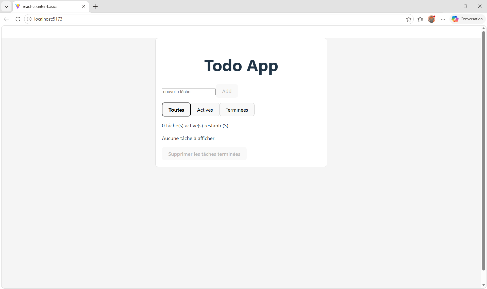

# 📝 Todo App (React)

Application Todo développée avec React dans le cadre de mon apprentissage du développement web.

## 🚀 Fonctionnalités

- Ajouter une tâche
- Supprimer une tâche
- Marquer une tâche comme terminée
- Modifier une tâche (édition inline)
- Supprimer automatiquement une tâche si le texte est vide lors de l'édition
- Filtrer les tâches (toutes / actives / terminées)
- Compteur de tâches restantes
- Persistance des données avec localStorage

## 🛠️ Technologies utilisées

- React (useState, useEffect)
- JavaScript (ES6+)
- HTML / CSS
- Vite
- Git / GitHub

## ▶️ Lancer le projet

```bash
npm install
npm run dev
```

Puis ouvrir : http://localhost:5173

## 📸 Aperçu


